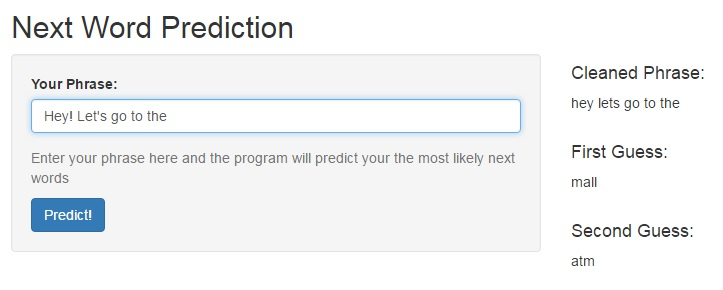

Next Word Prediction: Shiny Application
========================================================
author: Andrew Gaidus
date: May 26th, 2016

This presentation was developed as part of the capstone project for the Coursera Data Science specialization taught by Jeff Leek, Roger D. Peng, and Brian Caffo of Johns Hopkins University Bloomberg School of Public Health.

Background
========================================================

- <small>Natural language processing (NLP) is the science of applying computational models to human text and speech data.
- The purpose of this project is to use NLP to build an n-gram predictive text model that will calculate the most likely next word from a user-specified string of text input.
- An "n-gram" is a contiguous sequence of n items from a given text or speech.
- The n-gram dataset is built from a corpus called the [HC Corpora](http://www.corpora.heliohost.org/aboutcorpus.html). This corpus contains text from news, blogs, and twitter. The predictive model is then built off of this dataset.
- The final product is a web-based shiny application that predicts the next word based on user-input
</small>

Data Cleaning and Model Specification
========================================================
- <small> 5% of the total text data from HC Corpora was used
- Text was cleaned by converting all letters to lowercase, removing punctuation and numbers, and stripping whitespace.
- A table of the most frequent n-grams were created (unigrams, bigrams, trigrams, and quadgrams). 
- The next word is predicted using an N-Gram model with Stupid Backoff [Brants et. al 2007](http://www.aclweb.org/anthology/D07-1090.pdf).
- The model first checks for the highest order n-gram to predict the next word (n=4, in this model). If a match is not found, the model checks for trigram matches (n=3) and if still no match, the model checks for bigram matches (n=2)
- The input text provided by the user is cleaned using the same steps used to clean the raw data as to be comparing consistently formatted text
</small>

========================================================

<small><small>
The above screenshot shows the final Shiny application. In this example, I entered the phrase, "Hey! Let's go to the". The application first cleans the input phrase by converting to lowercase and removing punctuation, as seen to the right. Then it predicts the most likely next word ("mall") and the second most likey next word ("atm").
 
Since the highest order n-gram in the model is a quadgram, behind the scenes the application is searching the dataset for quadgrams that start with the 3 words "go", "to", "the". "Mall" is the most frequent next word, followed by "atm"
</small></small>

Conclusion
========================================================
<small>
The application is quite fast and returns a list of the two most likely next words in just a few seconds. However there are certainy ways in which this model can be improved:
* <b>Learning from user input</b>: The underlying table of n-grams can be updated and changed based on the text entered by the user. This would provide predictions that are more accurate specifically for that user.

* <b> Using more data and higher order n-grams </b>: Due to size constraints our model is relatively simple. However, with more data the algorithm could extend beyond quadgrams. The current algorithm discards information past 4-grams, which could potentially be useful for more accurate predictions.

The application can be accessed [here](https://agaidus.shinyapps.io/Final/)
</small>
