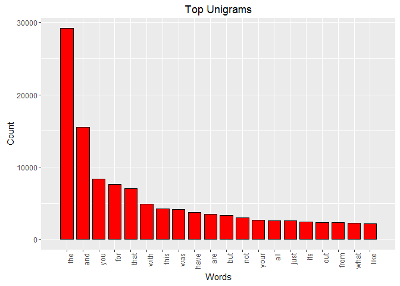
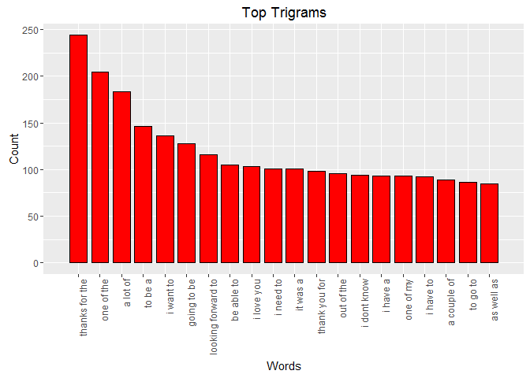

# Data Science Capstone: Exploratory Analysis Milestone Report
Andrew Gaidus  
Thursday, April 28, 2016  

This is the milestone report for the Exploratory Analysis section of the Coursera Data Science Capstone project. The goal of the capstone project is to build an application based off a predictive text model. The user will provide a word or a phrase and the application will try to predict the next word. The model will be trained using a corpus (a collection of English text) that is compiled from 3 sources - news, blogs, and tweets. 

In the following report, I load and clean the data as well as use NLM (Natural Language Processing) applications in R (tm and RWeka) to tokenize n-grams as a first step toward building a predictive model.


###Load Data
The first steps are to load the required libraries and set up the work environment. 

```r
Sys.setenv(JAVA_HOME="C:/Program Files (x86)/Java/jre1.8.0_91/")
library(RWeka)
library(dplyr)
library(stringi)
library(tm)
library(RWeka)
library(ggplot2)
```

It is assumed that the data has been dowloaded from here and unzipped: https://d396qusza40orc.cloudfront.net/dsscapstone/dataset/Coursera-SwiftKey.zip

Once it is, I can go ahead and read in the text files.


```r
blogs <- readLines("P:/Documents/DataScience/Capstone/Data/Coursera-SwiftKey/final/en_US/en_US.blogs.txt", encoding = "UTF-8", skipNul = TRUE)
news <- readLines("P:/Documents/DataScience/Capstone/Data/Coursera-SwiftKey/final/en_US/en_US.news.txt", encoding = "UTF-8", skipNul = TRUE)
twitter <- readLines("P:/Documents/DataScience/Capstone/Data/Coursera-SwiftKey/final/en_US/en_US.twitter.txt", encoding = "UTF-8", skipNul = TRUE)
```

###Summary Statistics
To get a sense of what the data looks like, I determine the number of lines, number of characters, and number of words for each of the 3 datasets (twitter, blogs, and news). I also calculate some basic statistics on the number of words per line (min, mean, and max).

```r
WPL=sapply(list(blogs,news,twitter),function(x) summary(stri_count_words(x))[c('Min.','Mean','Max.')])
rownames(WPL)=c('WPL_Min','WPL_Mean','WPL_Max')
stats=data.frame(
  Dataset=c("blogs","news","twitter"),      
  t(rbind(
  sapply(list(blogs,news,twitter),stri_stats_general)[c('Lines','Chars'),],
  Words=sapply(list(blogs,news,twitter),stri_stats_latex)['Words',],
  WPL)
))
head(stats)
```

```
##   Dataset   Lines     Chars    Words WPL_Min WPL_Mean WPL_Max
## 1   blogs  899288 206824382 37570839       0    41.75    6726
## 2    news   77259  15639408  2651432       1    34.62    1123
## 3 twitter 2360148 162096241 30451170       1    12.75      47
```
As we can see above, blogs tend to have the most words per line and tweets tend to have the least. This is what we would expect to see, given the character limit to tweets.

###Clean and sample data
I first go ahead and remove all non-English characters and then go ahead and compile a sample dataset that is composed of 1% of each of the 3 original datasets.

```r
blogs <- iconv(blogs, "latin1", "ASCII", sub="")
news <- iconv(news, "latin1", "ASCII", sub="")
twitter <- iconv(twitter, "latin1", "ASCII", sub="")

set.seed(519)
sample_data <- c(sample(blogs, length(blogs) * 0.01),
                 sample(news, length(news) * 0.01),
                 sample(twitter, length(twitter) * 0.01))
```

###Build corpus
Next I will use the functions within the tm package to build and clean my corpus that will be analyzed. After building the corpus, I convert everything to lower case, remove punctuation and numbers, strip white space, and then convert it to plain text.

```r
corpus <- VCorpus(VectorSource(sample_data))
corpus <- tm_map(corpus, tolower)
corpus <- tm_map(corpus, removePunctuation)
corpus <- tm_map(corpus, removeNumbers)
corpus <- tm_map(corpus, stripWhitespace)
corpus <- tm_map(corpus, PlainTextDocument)
```

###Tokenize and Calculate Frequencies of N-Grams
I use the RWeka package to construct functions that tokenize the sample and construct matrices of uniqrams, bigrams, and trigrams. 


```r
uni_tokenizer <- function(x) NGramTokenizer(x, Weka_control(min = 1, max = 1))
bi_tokenizer <- function(x) NGramTokenizer(x, Weka_control(min = 2, max = 2))
tri_tokenizer <- function(x) NGramTokenizer(x, Weka_control(min = 3, max = 3))

uni_matrix <- TermDocumentMatrix(corpus, control = list(tokenize = uni_tokenizer))
bi_matrix <- TermDocumentMatrix(corpus, control = list(tokenize = bi_tokenizer))
tri_matrix <- TermDocumentMatrix(corpus, control = list(tokenize = tri_tokenizer))
```

Then I find the frequency of terms in each of these 3 matrices and construct dataframes of these frequencies.
###Calculate frequency of n-grams

```r
uni_corpus <- findFreqTerms(uni_matrix,lowfreq = 50)
bi_corpus <- findFreqTerms(bi_matrix,lowfreq=50)
tri_corpus <- findFreqTerms(tri_matrix,lowfreq=50)

uni_corpus_freq <- rowSums(as.matrix(uni_matrix[uni_corpus,]))
uni_corpus_freq <- data.frame(word=names(uni_corpus_freq), frequency=uni_corpus_freq)
bi_corpus_freq <- rowSums(as.matrix(bi_matrix[bi_corpus,]))
bi_corpus_freq <- data.frame(word=names(bi_corpus_freq), frequency=bi_corpus_freq)
tri_corpus_freq <- rowSums(as.matrix(tri_matrix[tri_corpus,]))
tri_corpus_freq <- data.frame(word=names(tri_corpus_freq), frequency=tri_corpus_freq)
head(tri_corpus_freq)
```

```
##                      word frequency
## a couple of   a couple of        89
## a little bit a little bit        50
## a lot of         a lot of       183
## all of the     all of the        62
## as well as     as well as        85
## back to the   back to the        55
```

###Make plots
Lastly, I write a function to plot the n-gram frequency and go ahead and plot the 20 most frequent Unigrams, Bigrams, and Trigrams.

```r
plot_n_grams <- function(data, title, num) {
  df2 <- data[order(-data$frequency),][1:num,] 
  ggplot(df2, aes(x = seq(1:num), y = frequency)) +
    geom_bar(stat = "identity", fill = "red", colour = "black", width = 0.80) +
    coord_cartesian(xlim = c(0, num+1)) +
    labs(title = title) +
    xlab("Words") +
    ylab("Count") +
    scale_x_discrete(breaks = seq(1, num, by = 1), labels = df2$word[1:num]) +
    theme(axis.text.x = element_text(angle = 90, hjust = 1))
}

plot_n_grams(uni_corpus_freq,"Top Unigrams",20)
```

 

```r
plot_n_grams(bi_corpus_freq,"Top Bigrams",20)
```

 

```r
plot_n_grams(tri_corpus_freq,"Top Trigrams",20)
```

 

###Next steps
This concludes the initial exploratory analysis. The next steps will be to build a predictive algorithm that uses an n-gram model with a frequency lookup similar to the analysis above. This algorithm will then be deployed in a Shiny app and will suggest the most likely next word after a phrase is typed.
